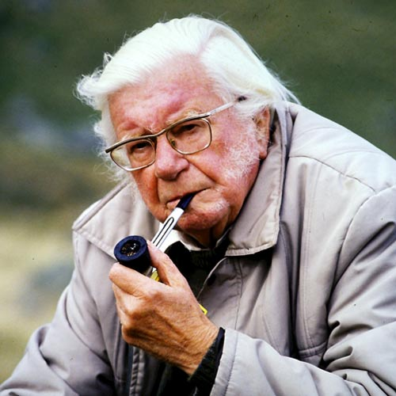

St Bees, Cumbria · 174 miles across England · Robin Hood's Bay, Yorkshire

## A walk across England

The Coast to Coast is one of England's great long-distance footpaths, crossing the full
width of northern England from the Irish Sea at St Bees in Cumbria to the North Sea at
Robin Hood's Bay in North Yorkshire. Wainwright's original route covers approximately
192 miles; our summit variant — optimised for high-level camps and direct ridgeline
crossings rather than valley detours — covers 174 miles with over 23,000 feet of ascent.
The route passes through three of England's finest National Parks and traverses some of
the most dramatic, varied and beautiful landscape in Britain.

### Three National Parks, one route

**Lake District** · Days 1–6 · 80 miles
Dramatic fells, high mountain passes and England's deepest lakes. The route summits
Kidsty Pike at 780m — the walk's highest point — and crosses Haystacks, where
Wainwright's ashes are scattered.

**Yorkshire Dales** · Days 7–10 · 50 miles
Stone barns, dry-stone walls, and the broad sweep of Swaledale — Wainwright's favourite
valley. The route crosses the Pennine watershed at Nine Standards Rigg and passes through
Keld, Reeth and Richmond.

**North York Moors** · Days 11–16 · 44 miles
Vast heather moorland, the dramatic Cleveland escarpment, and the old Rosedale ironstone
railway. The route finishes along spectacular sea cliffs before descending into Robin
Hood's Bay.

## Alfred Wainwright

**Alfred Wainwright MBE** — fell-walker, illustrator, author.

Born in Blackburn, Lancashire, Wainwright first visited the Lake District in 1930 and was
so captivated that he relocated to Kendal in 1941, working as Borough Treasurer while
spending every spare moment exploring and mapping the fells.

Between 1955 and 1966 he produced his seven _Pictorial Guides to the Lakeland Fells_ —
entirely hand-written and illustrated, describing 214 fells in meticulous detail. His
final major work, _A Coast to Coast Walk_ (1973), is widely considered his masterpiece —
a route that deliberately seeks out the highest ground, the wildest valleys and the most
dramatic ridgelines. Fifty years later, the line he drew remains the definitive way to
cross England on foot.

> All I ask for, at the end, is a last long resting place by the side of Innominate Tarn,
> on Haystacks… if you, dear reader, should get a bit of grit in your boot as you are
> crossing Haystacks in the years to come, please treat it with respect. It might be me.

— Alfred Wainwright, _Memoirs of a Fellwalker_

## The challenge

An estimated 6,000–10,000 people walk the Coast to Coast each year. Most do so between May
and September, using baggage transfer services to carry their luggage between
accommodations while they walk with a light daypack. That is a wonderful way to experience
this route — but it is not the walk we had planned.

| | Supported C2C itinerary | Wise Coast to Coast 2026 |
| --- | --- | --- |
| Season | Summer (June–August) | Late March — winter conditions on high ground |
| Support | Baggage transfer between accommodations | Fully self-supported — everything on our backs |
| Pack | Light daypack (3–5 kg) | Full expedition pack (13–15 kg) |
| Nights | B&Bs and guesthouses each night | 4 wild camps above 400m including summits |
| Daylight | Warm, long days (16+ hours) | Overnight temps as low as −10°C |
| Company | Well-trodden paths, other walkers daily | Drone carried throughout for aerial photography |

Walking in late March means winter conditions on the high fells — summit camps at
Haystacks (597m), Cringle Moor (432m) and Glaisdale Moor (400m) require four-season tents,
−10°C sleeping bags and full winter navigation equipment. There are no baggage vans or
support vehicles, and every piece of camping, cooking and survival equipment is carried in
a single expedition pack across all 174 miles and 23,000 feet of ascent.

A drone is also carried throughout to capture aerial photography of some of the most
spectacular landscapes in England — adding weight to an already heavy pack, but the images
will be worth it.

Of the thousands who walk the Coast to Coast each year, very few attempt it fully
self-supported with wild camping in winter conditions.

## The route

The 16-day itinerary balances wild camping on high ground with nights in characterful
traditional pubs and small hotels. The pattern is deliberate: push hard on the fells,
recover properly, push again.

Four nights wild camping at altitude. Traditional pubs with real fires and local ales —
including Tan Hill Inn (Britain's highest at 528m) and the Lion Inn at Blakey Ridge (16th
century, completely remote on the moor). Small hotels in Grasmere and Reeth for proper
recovery between the hard days.

Brother Ben joins for the final five days from Richmond, transforming solo endurance into
shared endeavour for the push across the Vale of Mowbray and the North York Moors to the
finish at Robin Hood's Bay — [the Wise Brothers](/wise-brothers/).
