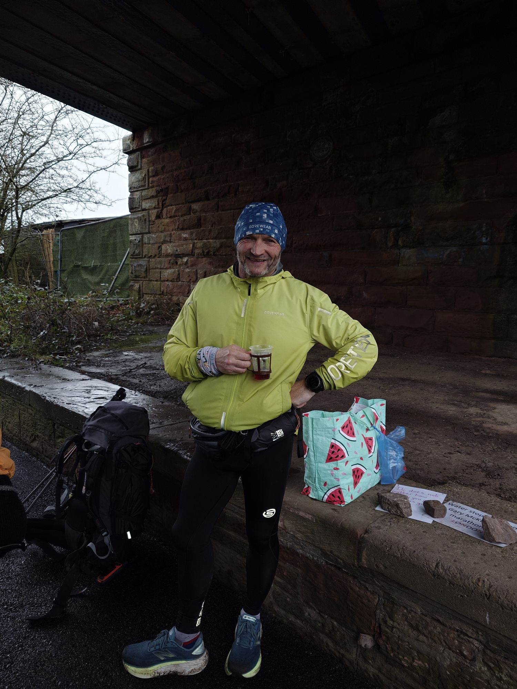

Many have expressed mild surprise about this plan

"what March THIS year?"

"did you say on your own?"

"maybe September would be a better time of year"

Well never let it be said that I don't listen. Today was quite tough (putting it mildly) but the trip is underway and I have already arranged for a safe place to leave 1.7Kg of drone that I won't be using in 40mph winds.

The first person I met this morning was a local lady walking her dog. "Coast to coast?" she said. "Starting or finishing?". I'd only walked half a mile!

A couple of hours later I met Gary who is running 100 marathons in a hundred days. Nice chap - poured me a cup of hot vimto. He did the Coast to Coast once, in January, in four days. So by lunchtime my morale was sky high. Then I got overtaken by a young couple.

About 3pm I stopped to get water from a stream knowing there was another climb before Ennerdale Bridge and seriously thought about pitching the tent. But I drank a half litre of Gatorade, ate a flapjack and shouldered the 18kg (soon to be 16kg) pack.

The scenery has been amazing, a bit of wind and some drizzle but nothing dramatic.

Tomorrow the mountains start.

And the camping.... in the 40mph winds, but the plan has changed to a valley floor camp because I am not insane.
