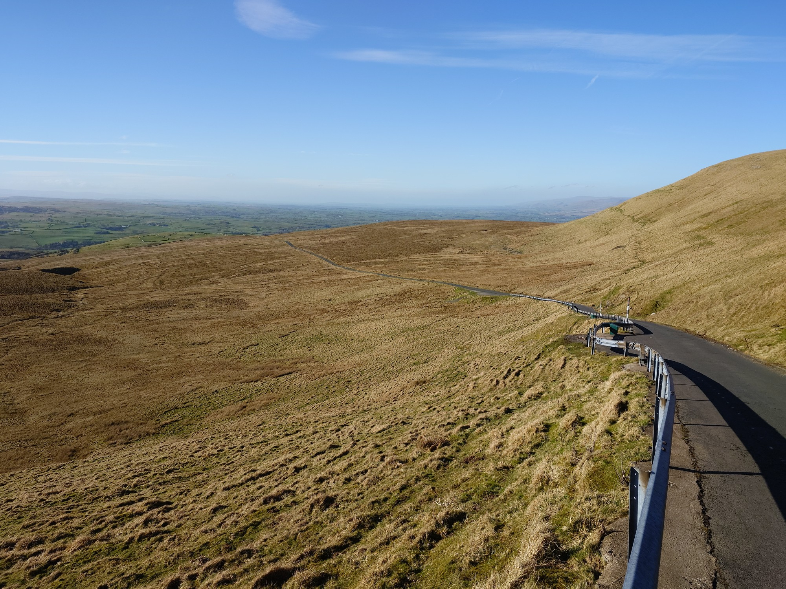
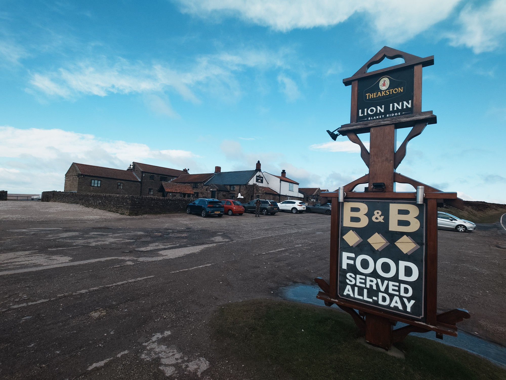

So the end is in sight and every step has been walked other than three miles from TV famous "Our Yorkshire Farm" to the Tan Hill Inn and Day 3 (mountains closed!)

Things I have been doing which have trumped blog writing..

-   Walking
-   Sleeping
-   Eating
-   Route checking
-   Provisioning
-   Ensuring I had enough drinking water
-   Blister care
-   Drying kit
-   Charging gadgets
-   Sampling local ales

Last day tomorrow and we took a team decision to switch camping for beds at the Horseshoe hotel in Egton Bridge. This makes the final leg tomorrow a bit of a stretch but hopefully the sea getting closer every hour will provide the required energy.

Yesterday on the North York Moors was very windy with rain driving straight at us and a disused railway that was easy navigation but went on for ever. At one stage when we had really had enough the Lion Inn appeared out of the mist across a large valley and then was gone again. It was another 40 minutes away but worth the effort. Tell me another pub that has three roaring fires going when you come down to breakfast at 8am??

One day to go, hopefully the weather will be kind and apparently our arrival at Robin Hood's Bay is timed perfectly to coincide with the launch of Coast to Coast as a National Trail. Maybe they knew we were coming?

https://www.timeout.com/uk/news/englands-most-famous-hike-finally-becomes-an-official-national-trail-this-week-032526
