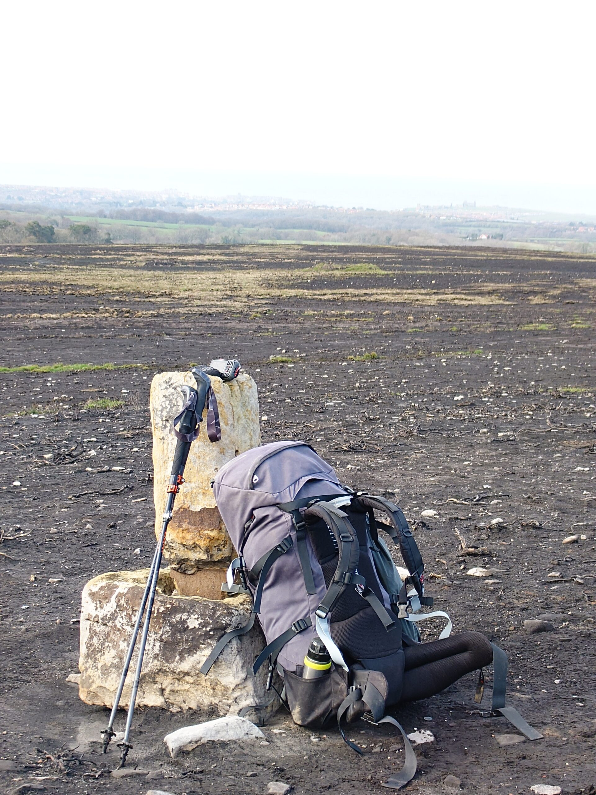

The longest day! A beautiful stroll by the river to Grosmont ("Growmont") and a coffee in the sun on the station platform. Restocked snacks at the country's oldest cooperative store. Our traveling companion Sissy from Germany caught up with us and we walked up a never-ending hill for about 30 mins, Sissy slowing her pace to 60% of usual to stay with us! Sissy stopped shortly afterwards as was booked to stay at a farm and spend the afternoon feeding the lambs.

The walk through Littlebeck wood is very picturesque but was not heading towards the Bay Hotel and our finish line so we cut that short and chose our own route across country.

The last three or so miles across burnt out gorse moors and down steep tarmac roads (downhill is the worst with sore feet and knees) we had slowed to about one mile per hour.

But the sea kept getting closer and then we could see breaking waves, and then a beach and then we were in the quaint, narrow streets and arrived at the Bay Hotel which if you can get a room (they only have three) is definitely the official finishing point. Excellent refreshment, official certificate purchased and a good night's sleep.

And that's it done. Coincidentally our arrival date of March 26th was the same day that Wainwright's Coast to Coast was upgraded to be a National Trail.
