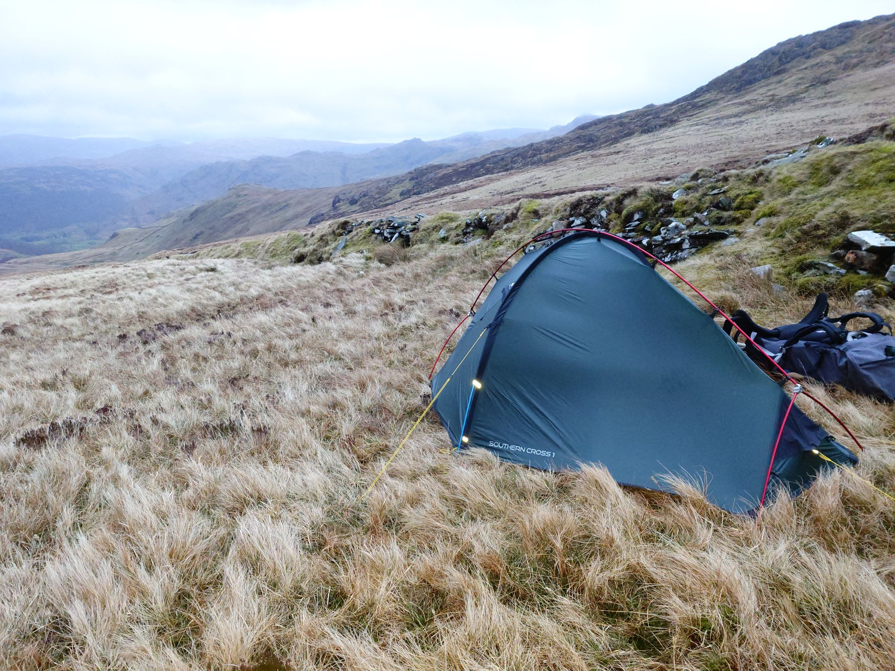
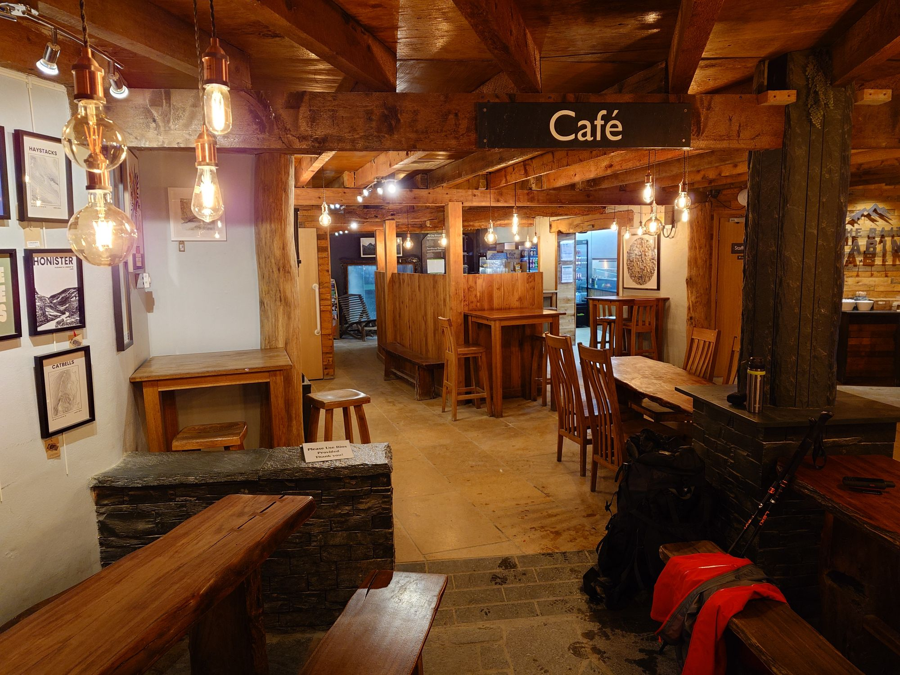

Days two and three were as tough as I hope they will get on this adventure. Despite claiming not to be insane I ended up camping at 500m with 40mph winds forecast. Tent was tucked in next to one of the old mine tracks which provided some shelter from the forecast wind direction.

The wind started building as forecast and then carried on building throughout the night. I don't have any video of this sadly as my phone had died. I kept thinking Sir Ranulph Fiennes would go out at this point and check the guy ropes!

8am with the wind as bad as ever and forecast to be the same or worse until midday I made coffee and ate a Phoenix bar (500 calorie flapjack) then struck camp and staggered off the hill being blown sideways. Only 15 minutes walking and I stumbled upon the oasis that is the Honister slate mine café. Coffee, bacon sandwich, no wind, battery charging!!

I then walked / was pushed by the wind down to Rosthwaite - going off the planned route into woods for some cover from the wind.

I honestly don't think I would have had the legs for the planned 10 miles to Grasmere but luckily the decision was out of my hands - the forecast was gusting 70mph on the peaks and that is not on my bucket list.

[https://www.nwemail.co.uk/news/25933365.record-breaking-89mph-winds-clocked-helvellyn-summit/](https://www.nwemail.co.uk/news/25933365.record-breaking-89mph-winds-clocked-helvellyn-summit/)

This presented another problem - 10 miles by footpath is about 30 miles by road. Luckily two buses solved the problem and by 5pm I had reached Tweedies Lodge in Grasmere who provided a comfortable room, a hot path and an excellent dinner.
